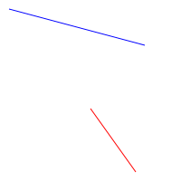
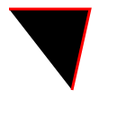
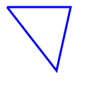
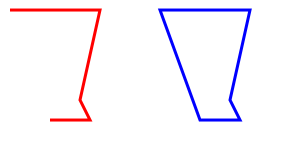

# Line

## line

- 일반 직선을 그릴때 사용한다.<br />

  

```html
<svg xmlns="http://www.w3.org/2000/svg" class="line" width="200" height="200">
  <style>
    .line {
      background-color: #eee;
    }
  </style>
  <!-- x1은 출발지점을 의미한다. x2는 끝점 y1 y축의 선에 출발 위치 y2는 y축 선 끝 위치 -->
  <!-- 쉽게 말해서 마우스를 갖다대는 곳에 x,y좌표가 있을것이다. 시작부터 끝까지 긋는다고 가정해보자. -->
  <!-- x1을 x좌표에 시작지점 x2를 x좌표 끝지점이라고 가정하면 너비가 된다. 
       y1을 y좌표 시작지점 y2를 y좌표 끝지점이라고 가정하면 높이가된다. 그렇게 생긴 사각형의 시작점부터 끝지점으로 대각선을 그어준다고 가정해보자.
   -->
  <!-- (10,10) 에서 그려지는 너비 150 높이 40짜리 직사각형의 시작부터 끝지점 (160,50)지점까지 선을 긋는것이다. -->
  <line x1="10" x2="160" y1="10" y2="50" stroke="blue" />
  <!-- (100,120) 에서 그려지는 너비 50 높이 70짜리 직사각형의 시작부터 끝지점 (150,190)지점까지 선을 긋는것이다. -->
  <line x1="100" x2="150" y1="120" y2="190" stroke="red" />
</svg>
```

## polyLine

- 좌표값에 따라서 이어준다. fill의 default 컬러는 black이다.




`첫번째 polyline`

```html
<svg xmlns="http://www.w3.org/2000/svg" class="line" width="150" height="150">
  <style>
    .line {
      background-color: #eee;
    }
  </style>
  <!-- 계속 이어지는 선 -->
  <!-- points x y ','마다 각 점을 이어준다. 아래 예시는 점 3개인 것  -->
  <!-- 첫번째 점은 (10,10) 다음 점은 (100, 10), 마지막 점 (80,100)좌표 지점에 점을 찍고 이어주는 개념이다. -->
  <!-- Stroke를 이어주는 것이다. fill 컬러는 채워진다. -->
  <polyline points="10 10, 100 10, 80 100" stroke="red" stroke-width="3" />
</svg>
```

`두번째 polyline (좌표지점을 4개로)`

```html
<svg xmlns="http://www.w3.org/2000/svg" class="line" width="150" height="150">
  <style>
    .line {
      background-color: #eee;
    }
  </style>
  <!-- 계속 이어지는 선 -->
  <!-- points x y ','마다 각 점을 이어준다. 아래 예시는 점 4개인 것  -->
  <!-- 첫번째 점은 (10,10) 다음 점은 (100, 10), (80,100), 마지막 점을 (첫번째 점으로 이동시키면 polygon과 동일)좌표 지점에 점을 찍고 이어주는 개념이다. -->
  <!-- Stroke를 이어주는 것이다. fill 컬러는 채워진다. -->
  <polyline points="10 10, 100 10, 80 100, 10 10" stroke="blue" stroke-width="3" fill="transparent" />
</svg>
```

## polygon

- polyline과 거의 유사하지만 끝맺음을 해준다는 차이점이 있다.
  <br />
  `(좌)polyline (우) polygon`

  

`default fill이 검정색이어서 transparent로 지정하여 배경색과 맞추었다.`

```html
<svg xmlns="http://www.w3.org/2000/svg" class="line" width="300" height="150">
  <style>
    .line {
      background-color: #eee;
    }
  </style>
  <polyline points="10 10, 100 10, 80 100, 90 120, 50 120" stroke="red" stroke-width="3" fill="transparent" />
  <!-- polyline과 동일하게 모양은 생성되지만, 도형을 마무리를 지어준다는 차이점이 있다.-->
  <polygon points="160 10, 250 10, 230 100, 240 120, 200 120" stroke="blue" stroke-width="3" fill="transparent" />
</svg>
```
