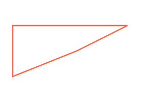

# Path

- 흠 이건 뭐랄까? 펜툴을 이용해서 그리는것과 비슷한 느낌이다.

## Straight Line (직선)

- 가장 기본적으로 선을 한번 그려보자. 펜을 가지고 자를 대고 쭈욱 그린다고 생각하고 그려보겠다.


`코드는 주석으로 잘 달아놓았다. M이 뭔지 L이 뭔지 H와 V에 대해서도 한번 보자.`

```html
<svg class="shapes" xmlns="http://www.w3.org/2000/svg" viewBox="0 0 600 400" width="300" height="200">
  <style>
    .shapes {
      width: 300px;
      height: 200px;
      background-color: #ddd;
    }

    path {
      stroke: tomato;
      stroke-width: 5;
      fill: transparent;
    }
  </style>
  <!-- path는 보통 일러스트레이터나 펜툴에서 사용한다. -->
  <!-- 그리기 위해서는 draw의 약자로 추정되는 d에 값을 넣어준다. -->
  <!-- 
      draw안에 내부 속성? (inner Attribute)
      1. M(Move?) - 해당 좌표로 이동을 시키는 것이다. 
      2. L(Line?) - 선을 그어주기 위한 속성으로 M지점부터 L에 지정한 좌표까지 선을 그어준다.
      3. H(Horizonal) - 수평으로 이동해준다 값으로는 X좌표 하나만 넣어주면 된다.
      4. V(Vertical) - 수직으로 이동해준다. 값으로는 Y좌표 하나만 넣어주면 된다.
      5. Z - 사용시 Polygon 처럼 마무리를 지어준다.
     -->
  <!-- (300,200)에서 출발해서 (500,100)으로 선으로 그어주고, 
      y좌표는 이동된지점부터 x좌표 50까지 그어주고, (50,200)
      x좌표는 이동된 50에 그대로두고 y좌표 300까지 그어준다. (50, 300)
    -->
  <path d="M 300 200 L 500 100 H 50 V 300"></path>
</svg>
```

> 크 선들이 잘이어지는게 보이는가...??



- 위 이미지와 다르게 그리고 이전에 배웠던 polygon과 유사하게 마무리 맺음을 지어주기 위해서는 Z 속성을 넣으면되는데 결과가 확실히 다르지 않는가 위코드와 차이점이라고는 Z의 유무다...

```html
<svg class="shapes" xmlns="http://www.w3.org/2000/svg" viewBox="0 0 600 400" width-"300" height="200">
  <style>
    .shapes {
      width: 300px;
      height: 200px;
      background-color: #ddd;
    }

    path {
      stroke: tomato;
      stroke-width: 5;
      fill: transparent;
    }
  </style>
  <path d="M 300 200 L 500 100 H 50 V 300 Z"></path>
</svg>
```

## Curve Line (곡선)

- 정말 말그대로다... 곡선이다. 곡선은 어떻게 그릴까?
  

```html
<svg class="shapes" xmlns="http://www.w3.org/2000/svg" viewBox="0 0 600 400">
  <style>
    .shapes {
      width: 300px;
      height: 200px;
      background-color: #ddd;
    }

    path {
      stroke: tomato;
      stroke-width: 5;
      fill: transparent;
    }
  </style>
  <!-- 
      곡선 그리기 
      d와 M의 역할은 직선과 동일하다.
      C의 
        첫번째 좌표로는 시작 좌표 지점이 되겠다. 
        두번째 좌표값은 커브의 기준점이 되겠다 마치 자석처럼 구부려서 거가로 지점이 닿게끔 만들어주는 자석같은 느낌?
        세번째 좌표값은 선의 마지막 좌표지점을 찍어주면된다.
      M을 찍을때마다 붓을 떼었다가 놓는다고 생각하면된다. fill을 꼭 다채우고 싶다면 필히... M을 여러번 쓰지말자..
    -->
  <path d="M 100 150 C 100 150, 300 50, 500 250"></path>
</svg>
```

### Bonus 못생긴 하트 모양

- 독자분들을 위한 제 마음입니다. <br />
  

```html
<svg class="heart" xmlns="http://www.w3.org/2000/svg" viewBox="600 600">
  <style>
    path {
      stroke: tomato;
      stroke-width: 5;
      fill: tomato;
    }

    @keyframes eye-ani {
      0% {
        transform: scale(0.5) translate(-100%, -100%);
      }

      25% {
        transform: scale(0.5);
      }

      50% {
        transform: scale(1.2);
      }

      100% {
        transform: scale(1.2) translateX(0) rotate(360deg) translate(0, 0);
      }
    }

    .ani-on {
      animation: eye-ani 1s infinite alternate;
      transform-origin: 150px 150px;
      transition: 1s;
    }
  </style>
  <script>
    const $heart = document.querySelector(".heart"); $heart.addEventListener("click", function() { this.childNodes.forEach((item) => { if
    (item.nodeName === 'path') { const hasClass = item.getAttributeNS(null, "class") === 'ani-on'; if (hasClass) { item.setAttributeNS(null,
    "class", ""); } else { item.setAttributeNS(null, "class", "ani-on"); } } }) })
  </script>
  <path d="M 150 100 C 150 100, 200 40, 235.5 120 C 235 120, 260 150, 150 250 C 150 250, 40 150, 65 120 C 65 120, 100, 40, 150 100 "></path>
</svg>
```
