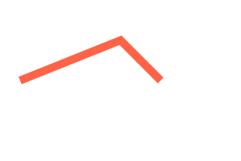
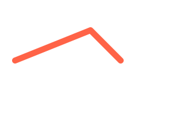
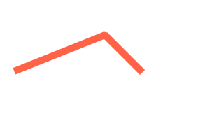

# Stroke Style & Group

## Stroke Style

- svg에 우리는 stroke를 지정해줄 수 있다.
- 지난 시간에 배운 path를 이용해서 그린 선에 스타일을 줘보자.

`stroke-linecap`: 라인의 끝점에 대한 스타일

`stroke-linejoin` : 라인과 라인의 접점에 대한 스타일

- 먼저 기본값을 줘보자! <br />
  `stroke-linecap: butt`
  `stroke-linejoin: miter`
  

```html
<svg class="stroke" xmlns="http://www.w3.org/2000/svg" viewBox="0 0 600 400" width="300" height="200" style="background-color: #ddd">
  <style>
    path {
      stroke: tomato;
      stroke-width: 20;
      /* 기본 값  */
      stroke-linecap: butt;
      /* 기본 값 */
      stroke-linejoin: miter;
      fill: transparent;
    }
  </style>
  <path d="M 50 200 L 300 100 L 400 200"></path>
</svg>
```

- 다음은 부메랑처럼 만나는지점도 그리고 끝점도 둥글게 만들어보자!
  `stroke-linecap: round`
  `stroke-linejoin: round`
  

```html
<svg class="stroke" xmlns="http://www.w3.org/2000/svg" viewBox="0 0 600 400" width="300" height="200" style="background-color: #ddd">
  <style>
    path {
      stroke: tomato;
      stroke-width: 20;
      /* 선의 접점을 제외한 끝지점을 둥글게  */
      stroke-linecap: round;
      /* 만나는지점을 둥글게 */
      stroke-linejoin: round;
      fill: transparent;
    }
  </style>
  <path d="M 50 200 L 300 100 L 400 200"></path>
</svg>
```

다음은 각진듯한 느낌을 줘보자 접점은 마치 위에가 싹둑된것처럼 사다리꼴모양으로 만들어보자

`stroke-linecap: square`
`stroke-linejoin: bevel`


```html
<svg class="stroke" xmlns="http://www.w3.org/2000/svg" viewBox="0 0 600 400" width="300" height="200" style="background-color: #ddd">
  <style>
    path {
      stroke: tomato;
      stroke-width: 20;
      /* 선의 접점을 제외한 끝지점을 사각지게  */
      stroke-linecap: square;
      /* 마치 머리를 도려낸것처럼 사다리꼴모양이다 */
      stroke-linejoin: bevel;
      fill: transparent;
    }
  </style>
  <path d="M 50 200 L 300 100 L 400 200"></path>
</svg>
```

## Group

- 우리가 지금껏 배운것들을 그룹지을 수 있다. `<g>`를 이용해서 묶어주고 거기에 해당클래스를 지정하면 해당 그룹에 대해 스타일을 같이 줄 수 있다.<br />

  

```html
<svg class="group" xmlns="http://www.w3.org/2000/svg" viewBox="0 0 600 400" width="300" height="200" style="background-color: #ddd">
  <style>
    .group {
      width: 300px;
      height: 200px;
      background: #ddd;
    }

    .group-1 {
      fill: #fff000;
    }
  </style>
  <!-- g를 이용하면 그룹으로 묶어줄 수 있다. -->
  <g class="group-1">
    <rect x="10" y="20" width="200" height="100"></rect>
    <rect x="50" y="170" rx="10" ry="10" width="100" height="100"></rect>
  </g>
  <circle cx="350" cy="350" r="30"></circle>
  <ellipse cx="400" cy="200" rx="100" ry="50"></ellipse>
</svg>
```

> 오늘은 여기까지~
