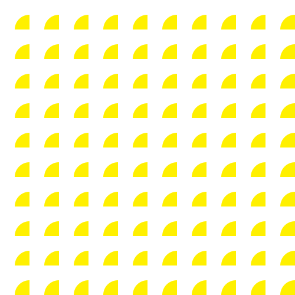

# Pattern

- 패턴이란 일정한 규칙을 갖고 반복되는 것을 의미하는데요.
- pattern 이라는 svgElement를 사용해서 개발하면 됩니다.

  <!--  -->
  

  ```html
  <svg class="svg" xmlns="http://www.w3.org/2000/svg" viewBox="0 0 500 500">
    <defs>
      <style>
        <![CDATA[
        .svg {
          width: 100%;
          height: 100%;
          background-color: #ddd;
        }

        .pattern-circle {
          <!-- 패턴에 색상 넣기 -->
          fill: #fff000;
        }

        .bg-rect {
          <!-- bg-rect를 패턴으로 채운다는 이야기다 -->
          fill: url("#bg-pattern")
        }
        ]]>
      </style>
      /* 가로 세로로 10개씩 넣겠다는 이야기다 */ /*
      <pattern id="bg-pattern" x="0" y="0" width="0.1" height="0.1">
        <circle cx="25" cy="25" r="25" class="pattern-circle" />
        /* 반지름 25 곧 지름이 50인 원을 width=0.1 height:0.1 10개씩 넣겠다는 이야기다. */
      </pattern>
      */
      <pattern id="bg-pattern" x="0" y="0" width="0.1" height="0.1">
        <circle cx="50" cy="50" r="25" class="pattern-circle" />
      </pattern>
    </defs>
    <rect width="100%" height="100%" x="0" y="0" class="bg-rect" />
  </svg>
  ```
